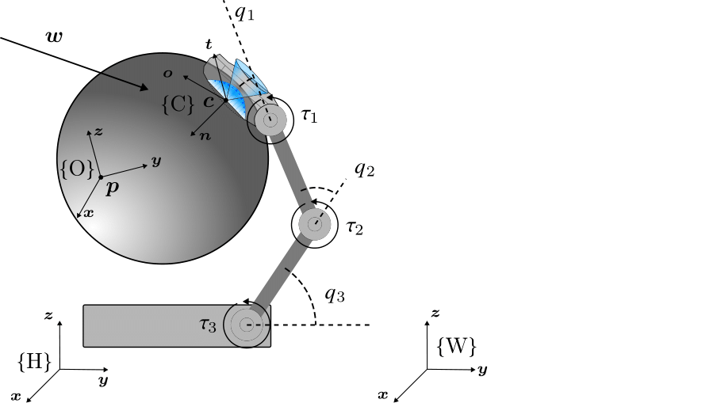
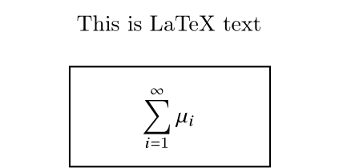
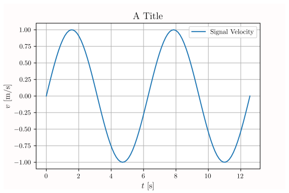

# Thesis Template

# Dependencies
Dependencies for utilizing the full template and utilities
- pdflatex 3.14159265-2.6-1.40.20
- Inkscape 1.2.2
- gs 9.50
- untex 1.2
- Python 3.8
	- lxml 4.6.5

# File Structure
The file structure of the project can be seen below

<details>
<summary>File Structure</summary>

``` bash
.
├── chapters
│   ├── 1-problem
│   ├── 2-problem
│   ├── 3-problem
│   ├── abstract
│   ├── acknowledgements
│   ├── appendix
│   ├── discussion-conclusion
│   ├── example
│   ├── introduction
│   ├── modeling
│   ├── state-of-the-art
│   └── system-setup
├── defs.tex
├── docs
│   ├── drawio.pdf
│   ├── drawio.png
│   ├── drawio.svg
│   ├── sys-schematic-reversed_cropped.svg
│   ├── sys-schematic-reversed.pdf
│   ├── sys-schematic-reversed.png
│   └── sys-schematic-reversed.svg
├── example.bib
├── glossary.tex
├── img
│   ├── front-page-image.png
│   ├── institution-logo.png
│   ├── placeholder.png
│   ├── sdu-logo.png
│   ├── sf-categories.pdf
│   └── sys-schematic-reversed-crop.pdf
├── main.tex
├── main.toc
├── README.md
├── resources
│   ├── resources-appendix.bib
│   ├── resources-example.bib
│   ├── resources-introduction.bib
│   ├── resources-modeling.bib
│   ├── resources-problem-1.bib
│   ├── resources-problem-2.bib
│   ├── resources-problem-3.bib
│   ├── resources-sota-problem-1.bib
│   ├── resources-sota-problem-2.bib
│   ├── resources-sota-problem-3.bib
│   ├── resources-system-setup.bib
│   └── resources-words.bib
├── titlepage.tex
├── utils
│   ├── ncrop
│   ├── pdfcompress
│   └── svg2latex
├── wc.sh
└── wc.tex
```
</details>

# Word Count
Since word count is mandatory for certain assignments, a script ``wc.sh`` is provided, which generates ``wc.tex`` containing the word count. The number is then auto-placed into the generated pdf. The script is auto-run by compiling the main document using ``pdflatex`` as shown below
```bash
pdflatex main.tex
```
# Figure Handling

When handling figures for $\LaTeX$ documents, two command line tools are developed to make the process less painful: ``svg2latex`` and ``pdfcompress``.

``svg2latex`` compiles ``.svg`` files with $\LaTeX$ equations into ``.pdf`` files without the necessary ``.pdf_tex``, while ``pdfcompress`` compresses the pdf using ghost script.

To generate the figure ``.svg`` files, tools such as [Inkscape](https://inkscape.org/), [draw.io](https://app.diagrams.net/) and [matplotlib](https://matplotlib.org/) are recommended and can be compiled to $\LaTeX$ using
```bash
svg2latex example.svg
```
One example can be seen below, where an Inkscape illustration ``.svg`` is compiled.
<p float="middle">
  
  
</p>
Below is an example generated in draw.io
<p float="middle">
  
  
</p>

In these cases, the extra white space is caused by the text box of the inserted text. This can be cropped using Inkscape. 

To generate $\LaTeX$ compiled plots, ``matplotlib`` supports directly exporting to pdf. One example can be seen below

```python
import matplotlib.pyplot as plt
import numpy as np

plt.rcParams['text.usetex'] = True
x = np.linspace(0, 4 * np.pi, 100)

plt.grid()

y = np.sin(x)
plt.title(r"\Large $$ \textrm{A Title} $$")
plt.xlabel(r"\large $$ t \textrm{ [s]} $$")
plt.ylabel(r"\large $$ v \textrm{ [m\slash s]} $$")
plt.plot(x, y,label=r"$$ \textrm{Signal Velocity} $$")
plt.legend()

plt.show()
```



If the generated ``example.pdf`` is too large, it can be compressed using 
```bash
pdfcompress example.pdf
```
This will generate ``example-comp.pdf`` using ghost script.

The figure can then be inserted into your $\LaTeX$ document using
```latex
\begin{figure}[h]
	\begin{small}
		\begin{center}
			\includegraphics[width=0.8\textwidth]{img/example.pdf}
		\end{center}
		\caption{Example figure.}
		\label{fig:example}
	\end{small}
\end{figure}
```